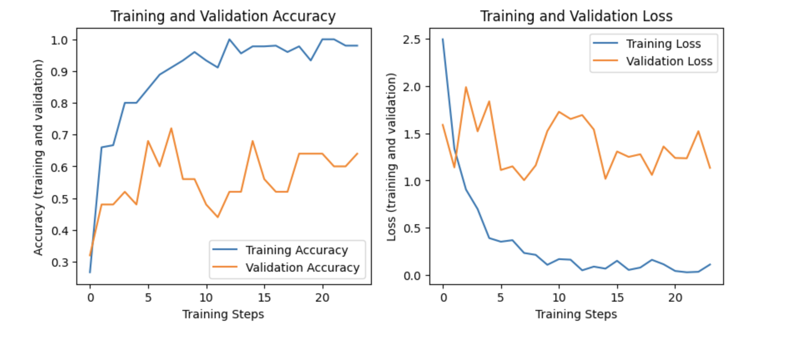
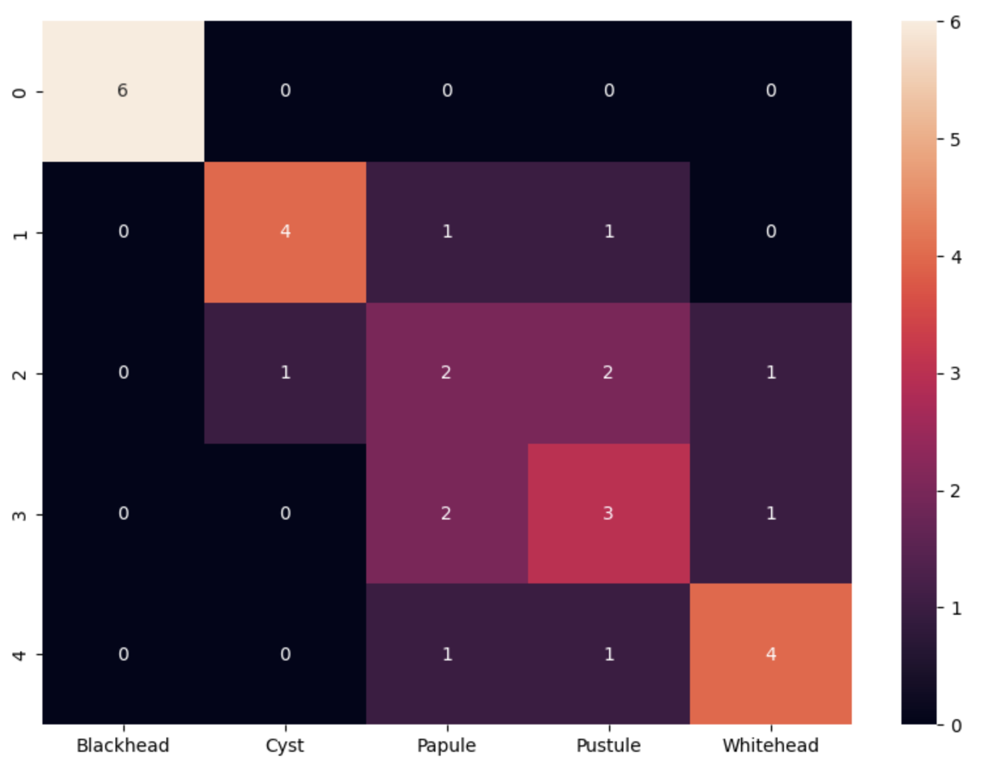

# AcneVue

## Inspiration
For years, the field of dermatology has been facing a myriad of challenges, some of which include the accuracy and efficiency of diagnosing skin conditions. Skin disease diagnoses were traditionally based on visual inspections, observations, and measurements. However, the accuracy of these methods will vary between healthcare professionals and dermatologists, depending on their experience and skills. As a result, skin conditions are often misdiagnosed, leading to severe consequences. With the advancement of Machine Learning in recent years, healthcare professionals and dermatologists can use this technology to gain faster and more precise results. Our team was inspired by the challenges that skin conditions pose, and by the immense potential that ML could bring to the field of dermatology.

## What Our Project Does
Our website is capable of classifying 5 different types of skin conditions (blackhead, cyst, whitehead, papule, and pustule) using selfies taken or uploaded by users. From there, we would provide users with tailored insights on how to alleviate the condition.

## How We Built It
We trained an acne classifier from 100 images using TensorFlow and Keras. Then, we built the back-end component using Flask and the front-end using React.

## Challenges We Ran Into
During the project, we encountered several issues
- For the ML model, we weren't able to find a lot of available quality images that could be used to train the model.
- At first, we planned to build the website using only React and encountered huge obstacles with parsing JSON files since some Keras layers were not compatible with TensorFlow.js, so we decided to implement the back-end using Flask to solve the issue.
- Our team didn't have prior experience with back-end so we also faced some issues while implementing it.
  
## Our Accomplishments
Using only a very limited set of data, we managed to build our first ML model capable of classifying 5 different types of skin conditions, _**achieving an accuracy of more than 60%**_ 

### Classifying Accuracy and Loss Graph
 

### Confusion Matrix
  

## What We Learned
As for the technical part, we learned about creating a Machine Learning model using TensorFlow and Keras, and about how to create a full-stack web app with Flask and React. Besides, we also acquired a lot of knowledge about skin conditions, especially the 5 types that we trained our model to classify.

## Future Improvements
- Further enhance the accuracy of our model with a better dataset.
- Train our model to classify the severity of skin conditions, skin types, and skin tones.
- Implement the feature to create personalized skincare regimes based on the given information.
- Develop a mobile app for the project.
- Improve the user experience by making it compatible with more devices.
